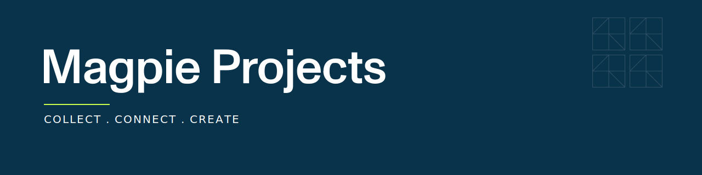

  

 

  <strong>Specialist execution partner for operational resilience in regulated capital markets.</strong> 
  Emerging from LPA Consulting, we bring over two decades of capital markets expertise — now sharpened on forward-looking strategic transformation.

  
  
  
  

---

### `COLLECT . CONNECT . CREATE`

|  |  |
|---|---|
| **Collect** | We gather market insights, regulatory intelligence, and operational feedback — a clear foundation for strategic decisions. |
| **Connect** | We link clients with the right partners, talent, and strategies, strengthening internal agility and external relationships. |
| **Create** | We co-create targeted, practical solutions that embed emerging technologies thoughtfully — built for stable operations under evolving compliance. |

---

### What we know best

- **Risk**
- **Compliance**
- **Operations**
- **AI & Data**

We design, build and implement auditable operating environments across mission-critical workflows in Capital Markets. Offices in Frankfurt and Zurich, operating across the DACH region.

---

### Code

Most of our work lives in private repositories, built with and for our clients. This organization exists as a public point of contact.

---

### Get in touch

**Magpie Projects GmbH**
Große Gallusstraße 9 · D-60311 Frankfurt · Germany

[magpieprojects.com](https://magpieprojects.com) · [contact@magpieprojects.com](mailto:contact@magpieprojects.com) · [LinkedIn](https://de.linkedin.com/company/magpie-projects) · [Careers](https://magpie.jobs.personio.com/)
